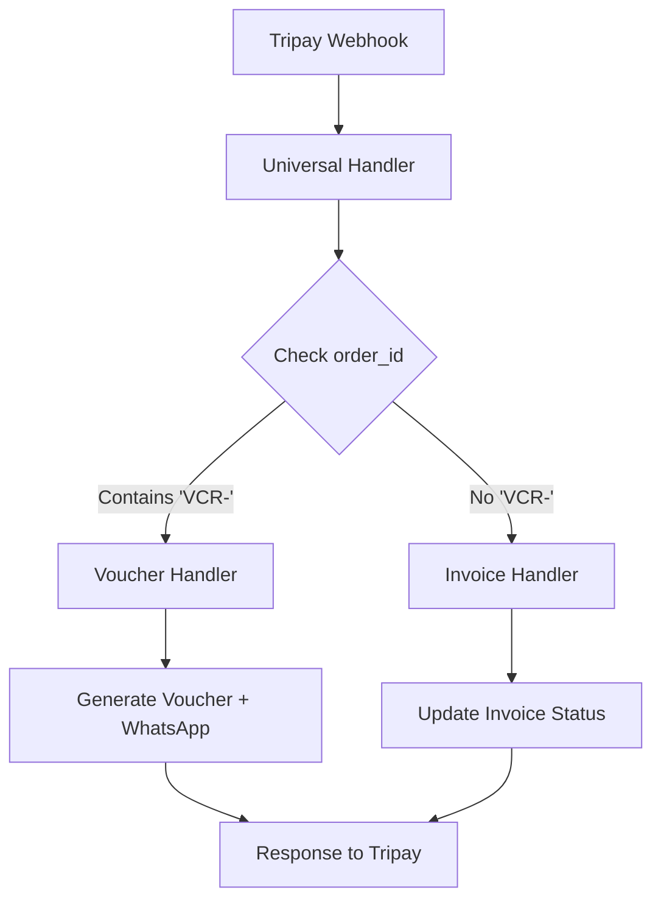

# KONFIGURASI WEBHOOK UNIVERSAL - TRIPAY

## 📋 **OVERVIEW**

Karena Tripay hanya mendukung 1 webhook URL di dashboard, kita menggunakan **Universal Webhook Handler** yang bisa menangani kedua jenis payment (invoice dan voucher) dalam 1 URL.

---

## 🔧 **KONFIGURASI DI TRIPAY DASHBOARD**

### **Webhook URL (HANYA 1 URL):**
```
https://alijaya.gantiwifi.online/payment/webhook/tripay
```

**Notes**: URL ini akan menangani **semua payment** (invoice + voucher) dan secara otomatis mengarahkan ke handler yang sesuai.

---

## 🎯 **CARA KERJA UNIVERSAL WEBHOOK**

### **1. Deteksi Jenis Payment**
Universal webhook handler mendeteksi jenis payment berdasarkan `order_id`:

```javascript
const orderId = req.body.order_id || req.body.merchant_ref || '';
const isVoucherPayment = orderId.includes('VCR-') || orderId.includes('VOUCHER-');
```

### **2. Routing Auto**
- **Jika `order_id` mengandung 'VCR-'** → Redirect ke voucher webhook handler
- **Jika `order_id` tidak mengandung 'VCR-'** → Process sebagai invoice payment

### **3. Pattern Order ID**

| Payment Type | Order ID Pattern | Example |
|-------------|------------------|---------|
| **Invoice** | `INV-INV-XXXXX-XX` | `INV-INV-1757172817359-44` |
| **Voucher** | `INV-INV-VCR-XXXXX-XX` | `INV-INV-VCR-1757172817359-44` |

---

## 🔄 **FLOW UNIVERSAL WEBHOOK**



---

## 🛠️ **IMPLEMENTASI TEKNIS**

### **1. Universal Webhook Handler**

**File**: `routes/payment.js`

```javascript
router.post('/webhook/tripay', async (req, res) => {
    try {
        console.log('🔍 Universal webhook received:', JSON.stringify(req.body, null, 2));
        
        // Check if this is a voucher payment based on order_id pattern
        const orderId = req.body.order_id || req.body.merchant_ref || '';
        const isVoucherPayment = orderId.includes('VCR-') || orderId.includes('VOUCHER-');
        
        if (isVoucherPayment) {
            console.log('🎫 Detected voucher payment, redirecting to voucher webhook handler');
            // Redirect to voucher handler
            return voucherRouter(mockReq, mockRes);
        } else {
            console.log('💰 Processing invoice payment');
            // Process as invoice payment
            const result = await billingManager.handlePaymentWebhook({ body: req.body, headers: req.headers }, 'tripay');
            res.status(200).json(result);
        }
    } catch (error) {
        console.error('Universal webhook error:', error);
        res.status(500).json({ success: false, message: error.message });
    }
});
```

### **2. Callback URL Configuration**

**File**: `config/paymentGateway.js`

```javascript
// Semua payment (invoice + voucher) menggunakan callback URL yang sama
callback_url: `${appBaseUrl}/payment/webhook/tripay`,
return_url: paymentType === 'voucher' ? `${appBaseUrl}/voucher/finish` : `${appBaseUrl}/payment/finish`
```

---

## 📊 **COMPARISON: DUAL vs UNIVERSAL WEBHOOK**

| Aspect | Dual Webhook | Universal Webhook |
|--------|-------------|------------------|
| **Tripay URLs** | 2 URLs (tidak mungkin) | 1 URL ✅ |
| **Complexity** | High | Low ✅ |
| **Maintenance** | Sulit | Mudah ✅ |
| **Reliability** | Rentan error | Robust ✅ |
| **Tripay Support** | Tidak didukung | Didukung ✅ |

---

## 🔍 **DEBUGGING UNIVERSAL WEBHOOK**

### **1. Monitor Log Server**

```bash
# Monitor log saat payment dilakukan
tail -f logs/app.log | grep -E "(Universal webhook|Detected voucher|Processing invoice)"
```

### **2. Test Webhook Manual**

```bash
# Test invoice payment
curl -X POST https://alijaya.gantiwifi.online/payment/webhook/tripay \
  -H "Content-Type: application/json" \
  -d '{
    "order_id": "INV-INV-1757172817359-44",
    "status": "success",
    "amount": 100000,
    "payment_type": "tripay"
  }'

# Test voucher payment
curl -X POST https://alijaya.gantiwifi.online/payment/webhook/tripay \
  -H "Content-Type: application/json" \
  -d '{
    "order_id": "INV-INV-VCR-1757172817359-44",
    "status": "success",
    "amount": 10000,
    "payment_type": "tripay"
  }'
```

### **3. Expected Log Output**

**Invoice Payment:**
```
🔍 Universal webhook received: {...}
💰 Processing invoice payment
```

**Voucher Payment:**
```
🔍 Universal webhook received: {...}
🎫 Detected voucher payment, redirecting to voucher webhook handler
🎫 Voucher webhook response: {...}
```

---

## ⚠️ **TROUBLESHOOTING**

### **Masalah Umum:**

#### **1. Voucher tidak ter-generate**
- **Penyebab**: Order ID tidak mengandung 'VCR-'
- **Solusi**: Cek pattern order ID di `routes/publicVoucher.js`

#### **2. Invoice tidak ter-update**
- **Penyebab**: Order ID mengandung 'VCR-' padahal seharusnya invoice
- **Solusi**: Cek pattern order ID di `routes/adminBilling.js`

#### **3. Webhook tidak diterima**
- **Penyebab**: URL webhook salah di Tripay dashboard
- **Solusi**: Update webhook URL ke `https://alijaya.gantiwifi.online/payment/webhook/tripay`

---

## 🧪 **TESTING**

### **1. Test Invoice Payment**
1. Buat invoice di admin panel
2. Pay via Tripay
3. Cek log: `💰 Processing invoice payment`
4. Verifikasi status invoice ter-update

### **2. Test Voucher Payment**
1. Beli voucher di `/voucher`
2. Pay via Tripay
3. Cek log: `🎫 Detected voucher payment`
4. Verifikasi voucher ter-generate di Mikrotik
5. Verifikasi WhatsApp terkirim

---

## 🎉 **KEUNTUNGAN UNIVERSAL WEBHOOK**

### **✅ Keuntungan:**
- **1 URL saja** di Tripay dashboard
- **Auto routing** berdasarkan order ID
- **Mudah maintenance** dan debugging
- **Kompatibel** dengan semua payment gateway
- **Tidak ada breaking changes**

### **✅ Reliability:**
- **Centralized logging** untuk semua payment
- **Consistent error handling**
- **Easy monitoring** dan alerting

---

## 📝 **MIGRATION NOTES**

### **Backward Compatibility:**
- ✅ **Existing Invoices**: Tetap berfungsi normal
- ✅ **New Vouchers**: Auto ter-handle
- ✅ **No Configuration Changes**: Tidak perlu konfigurasi tambahan

### **Deployment:**
- ✅ **Immediate Effect**: Perubahan langsung berlaku
- ✅ **No Database Migration**: Tidak perlu migrasi database
- ✅ **No Service Restart**: Tidak perlu restart server

---

## 🎯 **SUMMARY**

**Konfigurasi di Tripay Dashboard:**
```
Webhook URL: https://alijaya.gantiwifi.online/payment/webhook/tripay
```

**Universal webhook handler** akan:
- **Deteksi otomatis** jenis payment berdasarkan order ID
- **Route ke handler yang tepat** (invoice atau voucher)
- **Process payment** sesuai dengan jenisnya
- **Return response** yang sesuai ke Tripay

**Sekarang kedua sistem payment bisa berjalan dengan 1 webhook URL!** 🎉

---

*Dokumentasi ini dibuat pada: 27 January 2025*
*Status: IMPLEMENTED ✅*
